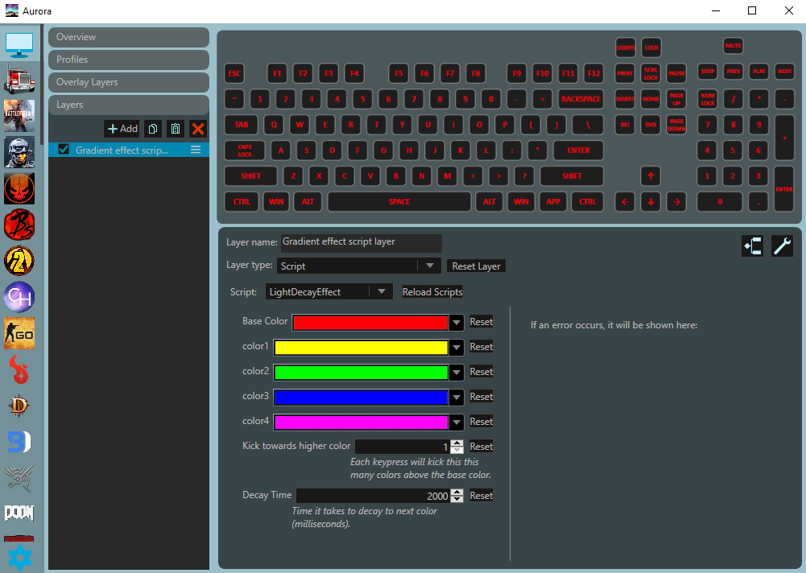

# Aurora-LightDecayEffect
A script layer built for Aurora to add a light decay effect layer.

## Effect

The effect is reactive based on each keypress you make on your keyboard. 
The layer starts with a base color that is defined by the user. 
Then after one key press, that key will get a "kick" to higher color. 
Then the effect goes through a series of linear gradients through the previous colors until it gets to the base color. 
If the same key is pressed while the gradients are being played then the gradient progression will be interrupted 
and the key will get another "kick" to higher colors and then begin the linear gradients towards the base color.
A screenshot of the interface for the layer is shown below:

The best way to describe the effect is to think of it where the list of colors make a hill and every keystroke places the ball further up the hill.
Then over time, the ball will roll down the hill, passing through each of the colors through a linear gradient. See the figure below for a visualization.

## Features

### Colors
LightDecayEffect supports one base color and up to four higher colors. 
You will not be able to set more than 4 colors but you are welcome to use less. 
If the higher colors are set to black (RGB = 0,0,0) then that color will not be used in the effect. For example, if you set the colors like so:
* Base Color:  (255, 0, 0)
* Color 1:  (255, 255, 0)
* Color 2:  (0, 255, 0)
* Color 3:  (0, 0, 255)
* Color 4:  (0, 0, 0)

Your after multiple kicks the max color your key will light will be Color 3, blue. Color 4 will not be 
used meaning you will only be using the Base color and Colors 1-3. If you like to use only 3 colors for 
the effect you can set Color 4 and Color 3 to black, then you will only use the Base color and Colors 1-2.

This will not work if you have black between two colors. In this instance the black color will be used so your 
gradient will include linear gradient that passes through black (unlit) led.

### Kick
Kick is the number of colors you advance along the effect with each key press. You can select any integer up to 4. Here are some examples:
* Kick = 1
  * Each key press will set the key to Color 1 where it then begins a linear gradient towards the Base Color.
  * If the key is pressed during its gradient between Color 1 and the Base Color, the key will be set to 
  Color 2 to begin linear gradients to Color 1 and then the Base Color.

* Kick = 2
  * Each key press will set the key to Color 2 where it will begin its linear gradient to Color 1 and then to the Base Color.
  * If the key is pressed during the gradient between Color 2 and Color 1 the key will be "kicked" to Color 4 where 
  it will begin its gradients between Colors 3, 2, 1, and then towards the Base Color.
  * If the key is pressed during the gradient between Color 1 and the Base Color then the key will be "kicked" to Color 
  3 where it will begin its gradients to Color 2, 1, and then to the Base Color.
  

### Decay Time

This is the amount of time it takes for the linear gradient to progress through two colors, 
in milliseconds. For example if Decay Time is set to 2000 ms and a key is pressed with a 
"kick" of 1 then it will take 2 seconds to complete the gradient effect from Color 1 to the Base Color.

## Install Instructions

Copy the script from `light_decay_layer/LightDecayEffect.cs` to the directory
`C:\Users\<USERNAME>\AppData\Roaming\Aurora\Profiles\desktop\Scripts`. More 
information about script layers can be found on the [Aurora Documentation](https://www.project-aurora.com/Docs/reference-layers/script/)
